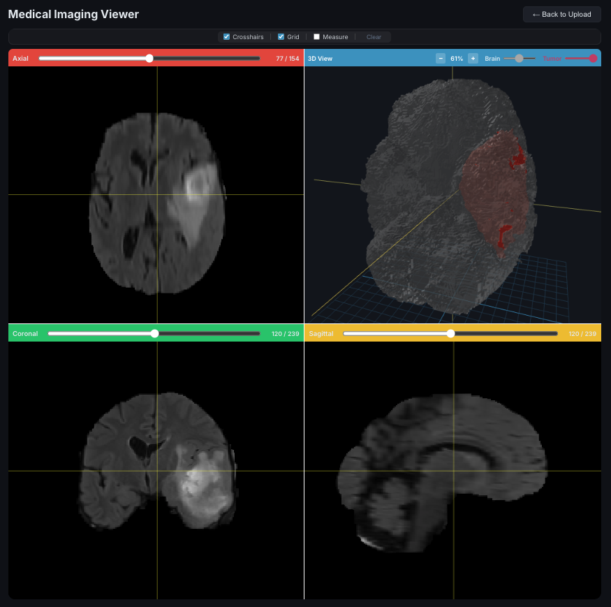

# Anatomical Modeling

A full-stack volumetric reconstruction engine that converts medical imaging brain scans (NIfTI) into physically accurate, watertight 3D meshes with synchronized 2D/3D visualization and measurement tooling.

Built with Python for image processing, TypeScript for orchestration, and React for interactive visualization.

---

## Demo



---

## Motivation

Magnetic resonance imaging (MRI) produces volumetric data that is typically reviewed as a sequence of 2D grayscale slices. While clinicians are trained to mentally reconstruct spatial relationships from these slices, patients often struggle to interpret what they are seeing.

For individuals diagnosed with brain tumors, this creates a significant communication gap. Patients frequently cannot:

- Visualize the three-dimensional extent of a lesion
- Understand how close a tumor is to critical brain regions
- Intuitively grasp how growth or treatment might affect surrounding structures

Even for clinicians, navigating volumetric datasets requires specialized software and manual slice-by-slice inspection.

This project was built to reduce that cognitive barrier by converting raw volumetric imaging data into physically accurate 3D reconstructions with synchronized 2D/3D navigation. By preserving voxel-to-world coordinate fidelity and enabling crosshair-linked slice exploration, the system makes spatial relationships immediately interpretable.

It is not a diagnostic tool, but rather a geometric reconstruction and visualization engine designed to improve spatial understanding of volumetric medical data.

---

## Features

### Pipeline
- Upload NIfTI image (`.nii.gz`) + ground-truth tumor labels
- Classical segmentation fallback: Otsu thresholding + morphological operations
- Custom from-scratch Marching Cubes implementation for surface extraction
- Mesh repair and decimation via PyMeshLab
- Multi-format export: STL, OBJ, PLY

### Direct STL Viewing
- Drag-and-drop STL upload for immediate visualization
- Automatic brain/tumor classification
- Manual role correction for ambiguous files

### Real-Time Processing
- WebSocket progress updates during mesh generation (0-100%)
- Stage tracking: Upload, Segmentation, Mesh Generation, Finalization
- BullMQ job queue for async processing

### Interactive 3D Viewer
- Rotate and zoom with mouse/touch controls
- Quad-view mode: axial, sagittal, coronal slices + 3D view
- Crosshair synchronization across all four views
- Separate opacity and visibility controls per structure
- Measurement tools and grid overlay

---

## Architecture

```
Frontend (React + Three.js)
        |
        | HTTP / WebSocket
        v
Orchestration API (NestJS + BullMQ)
        |
        | Job Queue
        v
Imaging Worker (Python CLI)
        |
   +----+----+
   v         v
 Redis    MinIO (S3)
           PostgreSQL
```

---

## Processing Pipeline

The imaging worker converts raw NIfTI volumes into watertight 3D meshes through five stages:

### 1. Resample

`VolumeResampler` converts the input volume to isotropic spacing (default 1 mm^3) using SimpleITK. Supports linear and nearest-neighbor interpolation. Label volumes use nearest-neighbor to preserve discrete class boundaries.

### 2. Segment

**Primary path (ground-truth labels):** When a label file is provided (`--use-labels`), the pipeline reads the pre-annotated tumor mask directly and generates a brain mask via Otsu thresholding + largest connected component extraction.

**Fallback (classical segmentation):** `ClassicalSegmenter` applies Gaussian smoothing, Otsu thresholding, morphological closing/opening, hole filling, and largest-component extraction to produce a brain mask. Tumor regions are identified by intensity thresholding within the brain mask (mean + k*std). `SegmentationMetrics` computes Dice coefficient and Hausdorff distance for validation.

### 3. Marching Cubes

A custom from-scratch implementation of the Lorensen & Cline (1987) algorithm. For each voxel cube, the 256-entry lookup table maps corner classifications to triangle configurations. Edge intersections are computed via linear interpolation, and vertex normals are derived from central-difference gradients of the scalar field. The output is transformed from voxel indices to physical (RAS) coordinates using the NIfTI affine matrix.

Unlike typical pipelines that rely on VTK black-box implementations, this project implements Marching Cubes from scratch to:

- Maintain full control over voxel-to-physical coordinate transforms
- Ensure affine-correct RAS space output
- Enable debugging of topology defects at every stage
- Support custom decimation and manifold repair workflows

Geometric correctness was validated by round-tripping meshes back through the coordinate pipeline and comparing against known physical landmarks.

### 4. Repair

`repair_mesh_advanced` uses PyMeshLab to produce watertight, manifold meshes:
- Remove duplicate/unreferenced vertices and degenerate faces
- Repair non-manifold edges and vertices
- Close holes (up to 100 edges)
- Re-orient faces consistently
- Optional quadric edge collapse decimation
- Recompute smooth vertex normals

### 5. Export

Writes meshes in STL (binary), OBJ (with normals), and PLY formats via trimesh.

---

## Geometric and Coordinate Guarantees

- Voxel-to-world conversion via NIfTI affine matrix
- Isotropic resampling prior to surface extraction
- Physical spacing preserved in exported meshes
- Central-difference gradient normals
- Manifold repair and watertight enforcement
- Automatic volume-based role validation (brain vs tumor)

---

## Quick Start

### Prerequisites
- Node.js 18+
- Python 3.10+
- Docker and Docker Compose

### 1. Start Infrastructure

```bash
cd infra
docker compose up -d
```

Service endpoints:
- PostgreSQL: `localhost:5432` (postgres / postgres / dicom_pipeline)
- Redis: `localhost:6379`
- MinIO API: `localhost:9000`
- MinIO Console: `localhost:9001` (minioadmin / minioadmin)

### 2. Set Up Imaging Worker

```bash
cd imaging-worker
python3 -m venv .venv
source .venv/bin/activate
cp .env.example .env
pip install -r requirements.txt
```

### 3. Set Up Orchestration API

```bash
cd orchestration
npm install
cp .env.example .env
npm run start:dev
```

### 4. Start Frontend

```bash
cd frontend
npm install
npm run dev
```

### 5. Access

- **Frontend**: http://localhost:5173
- **API**: http://localhost:3000
- **Swagger Docs**: http://localhost:3000/api

---

## Usage

### Web Interface

**NIfTI upload:**
1. Open http://localhost:5173
2. Upload an MRI image (`.nii.gz`) and tumor label file (`.nii.gz`)
3. Watch real-time progress as the pipeline runs
4. Interact with the 3D viewer when complete
5. Download generated STL/OBJ meshes

**STL upload:**
1. Drag and drop 1-2 STL files
2. System auto-classifies as brain/tumor
3. View immediately with adjustable opacity and visibility

### API

```bash
# Upload NIfTI image + labels
curl -X POST http://localhost:3000/studies/upload \
  -F "image=@Brain001.nii.gz" \
  -F "labels=@Brain001_seg.nii.gz"

# Check study status
curl http://localhost:3000/studies/{studyId}

# List available meshes
curl http://localhost:3000/studies/{studyId}/meshes

# Download a mesh
curl -L http://localhost:3000/studies/{studyId}/download/mesh/brain.stl -o brain.stl
```

### Imaging Worker CLI

The Python worker can also be used standalone:

```bash
cd imaging-worker
source .venv/bin/activate

# Resample to isotropic spacing
python -m src.cli resample volume.nii.gz output/ --spacing 1.0

# Segment with ground-truth labels (primary)
python -m src.cli segment image.nii.gz output/ --use-labels labels.nii.gz

# Generate meshes from segmentation mask
python -m src.cli mesh mask.nii.gz output/ --formats stl,obj
```

Run `python -m src.cli <command> --help` for full option details.

---

## Project Structure

```
AnatomicalModeling/
├── frontend/                    # React + Vite + Three.js
│   └── src/
│       ├── components/          # MeshViewer, QuadView, SliceViewer, etc.
│       ├── hooks/               # Custom React hooks (meshes, NIfTI, measurements)
│       ├── utils/               # Mesh analysis and classification
│       ├── api.ts               # API client
│       └── types.ts             # TypeScript types
│
├── orchestration/               # NestJS API server
│   └── src/
│       ├── studies/             # Upload, processing, download endpoints
│       │   ├── studies.controller.ts
│       │   ├── studies.service.ts
│       │   ├── studies.processor.ts   # BullMQ job processor
│       │   └── study.entity.ts
│       ├── events/              # WebSocket progress gateway
│       ├── jobs/                # Job entity
│       └── models/              # Model entity
│
├── imaging-worker/              # Python image processing
│   ├── src/
│   │   ├── prep/                # Volume resampling (isotropic spacing)
│   │   ├── seg/                 # Segmentation (ground-truth labels, Otsu fallback, metrics)
│   │   ├── surf/                # Custom Marching Cubes implementation
│   │   ├── mesh/                # PyMeshLab repair and decimation
│   │   ├── export/              # STL, OBJ, PLY export
│   │   ├── debug/               # Coordinate diagnostics
│   │   └── cli.py               # CLI entry point
│   ├── tests/                   # pytest suite
│   └── scripts/                 # Standalone utilities (validate_mesh.py)
│
└── infra/                       # Docker Compose
    └── docker-compose.yml       # PostgreSQL 16, Redis 7, MinIO
```

---

## Tech Stack

**Frontend:** React 18, TypeScript, Vite, Three.js, React Three Fiber, Socket.io-client

**Backend:** NestJS, TypeORM, BullMQ, Socket.io, AWS SDK (S3/MinIO)

**Imaging:** Python 3.10+, SimpleITK, NumPy, SciPy, scikit-image, PyMeshLab, trimesh

**Infrastructure:** PostgreSQL 16, Redis 7, MinIO, Docker Compose

---

## Development

### Tests

```bash
# Python worker
cd imaging-worker
pytest
pytest --cov=src tests/

# Backend API
cd orchestration
npm test

# Frontend
cd frontend
npm run build
```

---

## Limitations

- Classical segmentation is not clinically robust
- No DICOM support yet
- No GPU acceleration yet
- Not FDA-cleared; research use only

---

## Security

- Files stored with UUID-based keys in S3
- Presigned URLs with expiration for downloads
- CORS configured for frontend access
- No authentication in demo mode

---

## License

ISC
